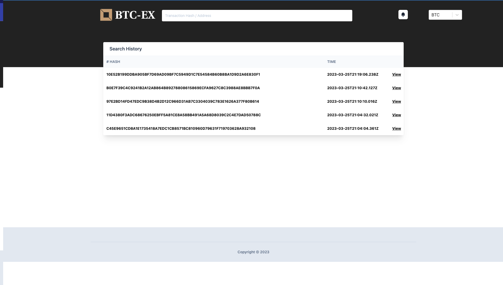

# Blockchain Explorer
## Problem Statement:
In this challenge we want you to build a simple app, using either ReactJS or React Native,
which retrieves address and transaction information from the BTC blockchain. It also allows a
user to subscribe for changes to specific hashes. Each subscribed hash should generate a
notification on the UI. Furthermore, the user should be able to select in which currency the
values should be displayed (USD, EUR or BTC).

```
Bonus points will be awarded for the implementation of a functionality that retrieves the top 5
searched addresses and transactions.
```

## Expected Output:

- Address search; (it will be user address and we need to get following details)
- - Number of confirmed transactions
- - Total BTC received
- - Total BTC spent
- - Total BTC un?pen
- - Current address balance

- Transaction search; (get details about specific transaction with his hash)
- - Transaction hash
- - Received time
- - Status
- - Size (in bytes)
- - Number of confirmations (the successful act of a?ing a tran?action and ading it to the blockcain)
- - Total BTC input
- - Total BTC output
- - Total fees (paid to process this transaction)

## Technology and Framework 
- NodeJs (Backend with express server and REST API)
- Frontend React (NextJS Framework)
- Tailwind (for CSS framework )
- MongoDB (to store data)
- Chai and Mocha

## Blockchain Node 
I used open-source free API to get details for Bitcoin Transactions and address [](https://www.blockchain.com/explorer/api/blockchain_api)  [for notification i am using Blockchain.com Websocket](https://www.blockchain.com/explorer/api/api_websocket)

```
// this will return details of user account
https://blockchain.info/address/bc1qk5pga4z53zf4hm0tqtf9nh3m454fdvwvnmh3z4?format=json

// this API will return upSpent Balance 
https://blockchain.info/unspent?active=bc1qk5pga4z53zf4hm0tqtf9nh3m454fdvwvnmh3z4 

// thus will return details related to transactions
https://api.blockchain.info/haskoin-store/btc/transaction/089b79b066685df7a03f06d8bc4f66bd05fbb2167301aab2cbd83e2e8ff586f4?format=json

```

## Test-case for functions response API

- First check API are Giving response on valid input.
- Second valid Response on Error and invalid input.
- Check response type is valid with class we define.
- Check response have all values are define and valid.
- Check some expected out from transaction response like size, total input , output  and fee.


### Transaction API Test Result
File  `/test/blockchain.transactions.test.js` with all test-cases shown below.
Chai and mocha is used for testing.
```
cd blockchain-api
npm run test
```
Result : Blockchain Api
```
   Account
    ✔ Check API Respond on valid Address hash
    ✔ Check API Respond on invalid Address hash (335ms)
    ✔ Check Response Instance
    ✔ Check Response data is instance of Account class
    ✔ Total input,output,balance and unspent all should define 
    ✔ Address is Define  

  Transactions
    ✔ Check API Respond on valid Tx hash
    ✔ Check API Respond on invalid Tx hash (298ms)
    ✔ Check Response Instance
    ✔ Check Response data is instance of Transaction class
    ✔ Check Transaction Received Time is Date instance
    ✔ Check no mine status should pending (612ms)
    ✔ Check mine status should Conformed
    ✔ Total input,output and fee BTC greater the Zero
    ✔ Block Size not equal to Zero
    ✔ confirmations  greater then zero if is status is conformed


  16 passing (4s)
```

Test on Backend API

```
cd backend
npm run test
```

Test Results:

```
  History
    ✔ Check API valid respond on valid Address hash (61ms)
    ✔ Check searchResults record not exceed length of 5 
    ✔ Check searchResults only remove 
    ✔ Check searchResults replace only old record 
    ✔ Check get history will give valid response on not existing record

  Notifications
    ✔ Check new notification is created with valid response
    ✔ Check update notification isNew status 
    ✔ Check update notification isNew status 

  Subscription
    ✔ Add new hash in user Subscription
    ✔ Check when add some hash in user Subscription
    ✔ Check deactivated Subscription
    ✔ Check getAll Subscription


  12 passing (726ms)
```


## Web-socket For Subscription

I have used  [Blockchain.com]("https://www.blockchain.com/explorer/api/api_websocket") websocket which help us to notify when every are new Block is created  we will check all the active Subscription and does there status change if yes then Deactive  Subscription and create new notification.


```
# cd backend/utils/web-socket.js
const wss_explorer = new WebSocketServer("wss://ws.blockchain.info/inv");

wss_explorer.addEventListener("message", (e) => {
  console.log("message", e.data);
});

wss_explorer.addEventListener("data", (e) => {
  console.log("data", e);
});
const interval = setInterval(() => ping(), 5000);

wss_explorer.addEventListener("open", (e) => {
  console.log("open");
  wss_explorer.send('{"op": "blocks_sub"}');
});

```

When every new block is created we check the active subscription which mean is change happen in transactions hash which user want to notify  -> what I am check here is only those transaction are allow to subscription which are in pending state and not `mine` yet ` when new block is create is notify in web-socket response we check the transaction status is change if change create notification for user`.

## Steps to Run the system.

- Run the mongodb  and backend service.
- -  There are two ways to run backend service
    1. run on terminal `cd backend && npm run dev`
    2. run with docker 

```

## Run mongoDB

docker-compose -f ./compose/docker-compose.yaml up -d mongodb


```

To run Backend and UI with `Docker` we need to build images first
It will build both images
- docker.io/blockchain-ex/blockchain-ex-backend 
- docker.io/blockchain-ex/blockchain-ex-ui

```

./build.sh

To start app run container with following commands

./run.sh

or 
docker-compose -f ./compose/docker-compose.yaml up -d backend ui


```

Or without Docker

```
cd backend
npm i
npm run start

Url -> http://localhost:8080

cd ../ui
npm i
npm run dev
Url -> http://localhost:3000
```


```
No Confirmation : 0 it zero because open API will not all get latest block it have some cors issue when  used in react
Confirmation= current.block -  traction.block +1 
``


## DEMO


